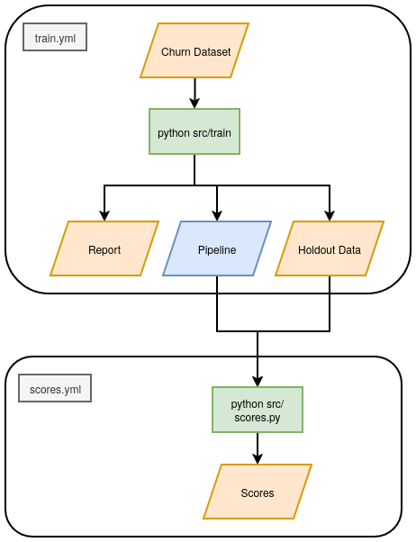

# churn_predictions
Predicting churn with the [Telco Customer Chrun dataset](https://www.kaggle.com/datasets/blastchar/telco-customer-churn)

(A project for my work experience at Sky UK.) 

Built with python, [scikit-learn](https://scikit-learn.org/stable/index.html) and [pandas](https://pandas.pydata.org/).

## Overview
This is an exercise in learning: to see how a modeling pipeline may be productionised.

The project has two associated Github Actions workflows:

- "train.yml" runs the python files under src/main which load the [telco data](./data/telco_data.csv). 
  - The data is split into training and testing as well as a holdout dataset with the target 'Churn' column removed.
  - A pipeline is created with (TODO outline model and preprocessor) and saved.
  - The pipeline, with the testing dataset is used to produce a [report on the model](./data/report.csv).

- "score.yml" loads the pipeline as well as the holdout data, and produces [scores](./data/scores.csv).

## Todo
- [X] Seperate scores script from model building
- [X] Remake the flow diagram to reflect changes to workflows
- [ ] Flesh out the report
- [ ] Improve on parameter and feature selection
- [ ] Produce scores for all data under a new dir 'scoring_data' with corresponding file names
- [ ] Create charts from the report
