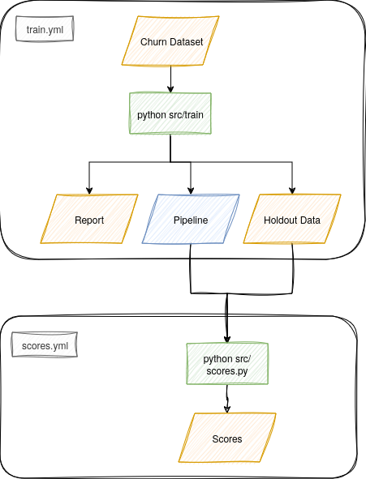

# churn_predictions
Predicting churn with the [Telco Customer Chrun dataset](https://www.kaggle.com/datasets/blastchar/telco-customer-churn)

(A project for my work experience at Sky UK.)

Built with python, [scikit-learn](https://scikit-learn.org/stable/index.html) and [pandas](https://pandas.pydata.org/).

## Overview

## Todo
- [X] Seperate scores script from model building
- [X] Remake the flow diagram to reflect changes to workflows
- [ ] Flesh out the report
- [ ] Improve on parameter and feature selection
- [ ] Produce scores for all data under a new dir 'scoring_data' with corresponding file names
- [ ] Create charts from the report
