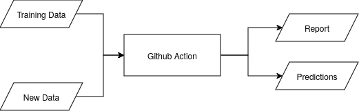

# churn_predictions
A project for my work experience at Sky UK.

Dataset used is the Telco Customer Churn dataset:
https://www.kaggle.com/datasets/blastchar/telco-customer-churn.

Built with python, [scikit-learn](https://scikit-learn.org/stable/index.html) and [pandas](https://pandas.pydata.org/).

## Aim
The goal is to be able to specify some training data, and data without targets ('Real' data), and have the program output its predictions for the real data as well as some scores in the form of a report on its performance across several metrics.

